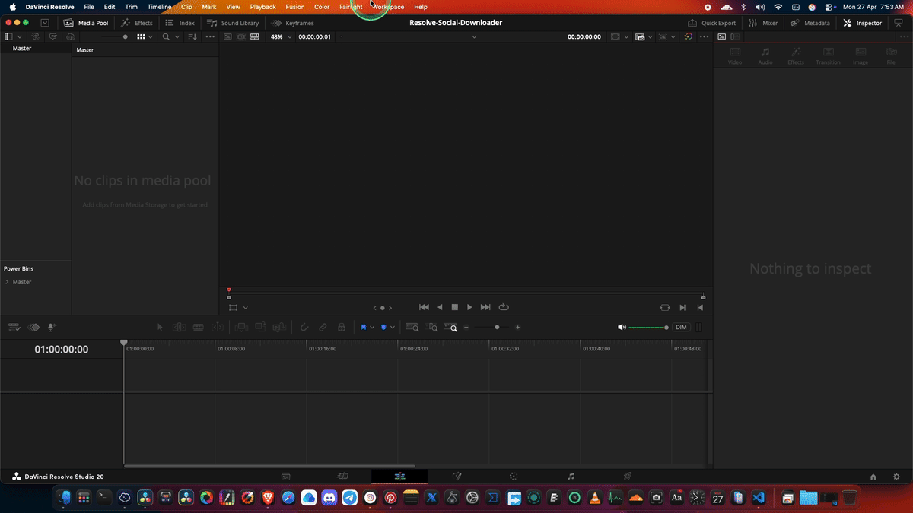

<div align="center">


[](https://git.io/typing-svg)

# 📥 Social Downloader for DaVinci Resolve

**A modern DaVinci Resolve utility script to download videos from major social platforms and import them directly into your Media Pool.**

<p>
  
  
  
  
  
  
  
</p>

<p>
  
  
  
  
  
  
  
  
</p>

</div>

---

## ✨ Overview

**Social Downloader** is a utility script for **DaVinci Resolve** available on both **macOS and Windows**.

It allows you to download media from popular social media platforms and optionally import the downloaded file directly into the **Resolve Media Pool**.

No browser-heavy workflow. No manual file hunting. Just a fast editor-friendly pipeline inside Resolve.

### Simple Workflow
**Paste URL → Get Info → Download → Import into Resolve**

---

## 🚀 Features

- **Auto platform detection**
- **Fusion UI inside DaVinci Resolve**
- **Download video in Best / 4K / 1080p / 720p**
- **Audio-only mode in WAV**
- **Subtitle download support**
- **Thumbnail saving**
- **Playlist support**
- **Automatic Resolve Media Pool import**
- **Download history**
- **Platform-based folder organization**
- **Improved video + audio merging**
- **MP4-focused output for better Resolve compatibility**

---

## 🧩 Supported Platforms

| Platform | Support |
|---|---|
| YouTube | ✅ Supported |
| Instagram | ✅ Supported |
| Pinterest | ✅ Supported |
| Twitter / X | ✅ Supported |
| TikTok | ✅ Supported |
| Facebook | ✅ Supported |
| Vimeo | ✅ Supported |
| Reddit | ✅ Supported |
| Auto-detect | ✅ Supported |

---

## 🖼️ Preview

<div align="center">

<table>
  <tr>
    <td align="center" style="padding: 0;">
      
    </td>
  </tr>
  <tr>
    <td align="center">
      <sub>
        
        &nbsp;
        
        &nbsp;
        
      </sub>
    </td>
  </tr>
</table>

</div>

---

## ⚙️ Requirements

### macOS 

- **macOS** (Intel or Apple Silicon)
- **DaVinci Resolve** 17 / 18 / 19 / 20 / 21
- **Homebrew**
- **yt-dlp**
- **ffmpeg**

### Windows 

- **Windows** 10 / 11
- **DaVinci Resolve** 17 / 18 / 19 / 20 / 21
- **yt-dlp**
- **ffmpeg**

> **Important:** `ffmpeg` is required for proper video/audio merging on several platforms.

---

## 📦 Installation

### macOS 

#### Option 1 — Installer Script

```bash
git clone https://github.com/praveensinghlko/Resolve-Social-Downloader.git
cd Resolve-Social-Downloader/macOS
chmod +x install.sh
./install.sh
```

The macOS installer will:
- copy the script to the correct DaVinci Resolve script folder
- check whether `yt-dlp` and `ffmpeg` are installed
- offer to install missing dependencies via Homebrew

#### Option 2 — Manual Install

```bash
cp macOS/Resolve-Social-Downloader.lua "$HOME/Library/Application Support/Blackmagic Design/DaVinci Resolve/Fusion/Scripts/Utility/"
brew install yt-dlp
brew install ffmpeg
```

---

### Windows 

#### Option 1 — Installer Script

1. Download or clone this repository  
2. Open the **Windows** folder  
3. Double-click **install.bat**  
4. If needed, right-click and **Run as Administrator**

The Windows installer will:
- copy the script to the correct DaVinci Resolve script folder
- check whether `yt-dlp` and `ffmpeg` are installed
- offer to install missing dependencies via `winget`

#### Option 2 — Manual Install

Copy `Windows/Resolve-Social-Downloader-Win.lua` to:

```text
C:\ProgramData\Blackmagic Design\DaVinci Resolve\Fusion\Scripts\Utility\
```

Install dependencies:

```text
winget install yt-dlp
winget install ffmpeg
```

---

## ▶️ Launch the Script

### macOS
```text
Workspace → Scripts → Utility → Resolve-Social-Downloader
```

### Windows
```text
Workspace → Scripts → Utility → Resolve-Social-Downloader-Win
```

---

## 🛠️ Usage

1. Paste a video URL into the input field  
2. Click **GET INFO**  
3. Select the platform or leave it on **Auto-detect**  
4. Choose the quality you want  
5. Enable optional features like subtitles, thumbnails, or audio-only mode  
6. Click **DOWNLOAD NOW**  
7. Choose whether to import the result into Resolve  

---

## 📁 Output Structure

### macOS
```text
~/Downloads/SocialDownloader/
```

### Windows
```text
C:\Users\YourName\Downloads\SocialDownloader\
```

Both platforms organize downloads like this:

```text
SocialDownloader/
├── YouTube/
│   └── thumbnails/
├── Instagram/
│   └── thumbnails/
├── Pinterest/
│   └── thumbnails/
├── Twitter/
│   └── thumbnails/
├── TikTok/
│   └── thumbnails/
├── Facebook/
│   └── thumbnails/
├── Vimeo/
│   └── thumbnails/
├── Reddit/
│   └── thumbnails/
├── Other/
│   └── thumbnails/
└── history.json
```

---

## 🔧 How It Works

This script combines a few powerful tools:

- **Lua** for the DaVinci Resolve / Fusion UI and logic
- **yt-dlp** for metadata extraction and downloading
- **ffmpeg** for merging, conversion, and post-processing
- **DaVinci Resolve API** for importing media directly into the Media Pool

---

## ✅ Version 5.1 Highlights

- Fixed **Instagram / Pinterest video + audio merge issues**
- Improved **YouTube WebM → MP4 conversion**
- Forced **MP4 output** for DaVinci Resolve compatibility
- Improved **ffmpeg auto-detection**
- Improved **downloaded file detection**
- Added **video track verification using ffprobe**
- Added **Windows support with dedicated installer**

---

## 🧪 Troubleshooting

### `yt-dlp not found`

**macOS**
```bash
brew install yt-dlp
brew upgrade yt-dlp
```

**Windows**
```text
winget install yt-dlp
```

### `ffmpeg not found`

**macOS**
```bash
brew install ffmpeg
```

**Windows**
```text
winget install ffmpeg
```

### Downloaded video has no audio

Make sure `ffmpeg` is installed and accessible in your Terminal or Command Prompt.

### Instagram, Pinterest, or YouTube download fails

Update `yt-dlp`:

**macOS**
```bash
brew upgrade yt-dlp
```

**Windows**
```text
winget upgrade yt-dlp
```

### “Run this script from within DaVinci Resolve”

This script must be launched **inside DaVinci Resolve**, not from Terminal or Command Prompt.

### Import to Media Pool fails

- Make sure a Resolve project is currently open
- Check that the file was downloaded successfully
- Try importing the file manually from the output folder

### Windows installer needs permission

If `install.bat` cannot copy files into the Resolve scripts folder, run it as **Administrator**.

---

## 🗂️ Project Structure

```text
Resolve-Social-Downloader/
├── assets/
│   └── demo.gif
├── macOS/
│   ├── Resolve-Social-Downloader.lua
│   └── install.sh
├── Windows/
│   ├── Resolve-Social-Downloader-Win.lua
│   └── install.bat
└── README.md
```

---

## 🗺️ Roadmap

- [x] Windows support
- [ ] Batch URL download support
- [ ] Real-time progress bar
- [ ] Custom output folder selector
- [ ] More supported platforms
- [ ] Better thumbnail preview rendering
- [ ] Persistent user settings

---

## 🤝 Contributing

Contributions are welcome.

```bash
git checkout -b feature/your-feature-name
git commit -m "feat: describe your change"
git push origin feature/your-feature-name
```

You can help with:

- bug fixes
- UI improvements
- metadata parsing improvements
- platform support expansion
- Resolve workflow enhancements

---

## 📜 Changelog

### v5.1
- Fixed merge issues for Instagram and Pinterest
- Improved MP4 output compatibility
- Improved file detection after download
- Improved ffmpeg integration
- Added media verification checks
- Added Windows support with installer files

### v5.0
- Complete UI redesign
- Added download history
- Added preview section
- Added platform-specific format handling

### v4.x
- Core downloading functionality
- Resolve Media Pool import support

---

## ⚠️ Disclaimer

This project is intended for **personal and educational use only**.

Please:

- respect each platform's Terms of Service
- avoid downloading copyrighted content without permission
- support original creators whenever possible

---

## 📄 License

This project is licensed under the **MIT License**.

```text
Copyright (c) 2024 Praveen Singh
```

---

## 👨‍💻 Author

**Praveen Singh**  
🌐 [praveensingh.pro](https://praveensingh.pro/)

If this project helps you, consider giving it a **star** on GitHub.

---

<div align="center">

### ⭐ Built for editors who want speed inside DaVinci Resolve


</div>
